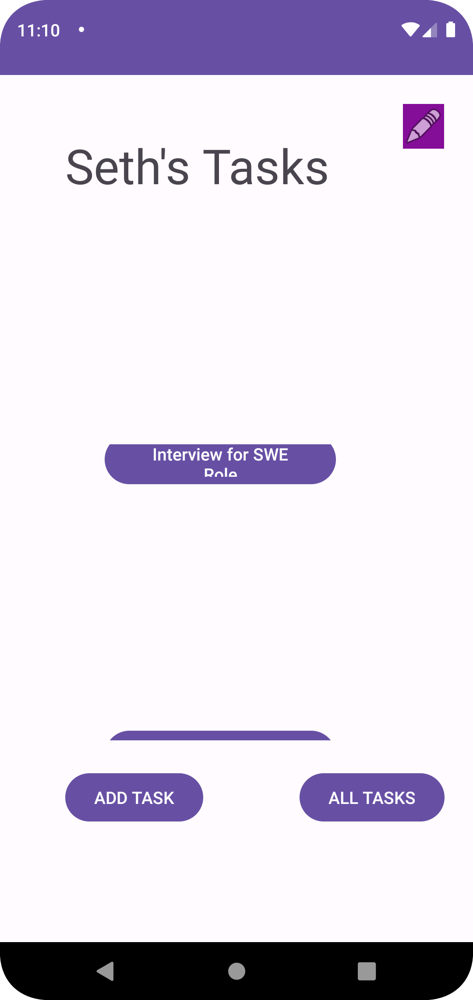
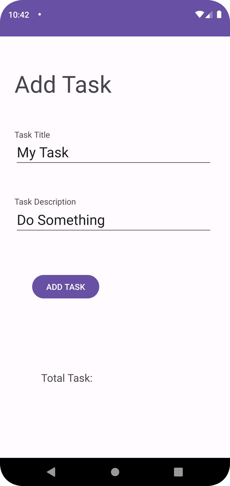
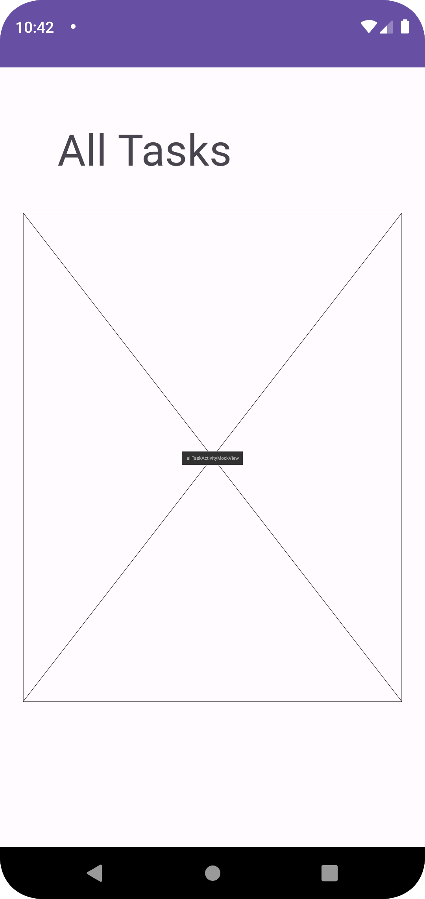
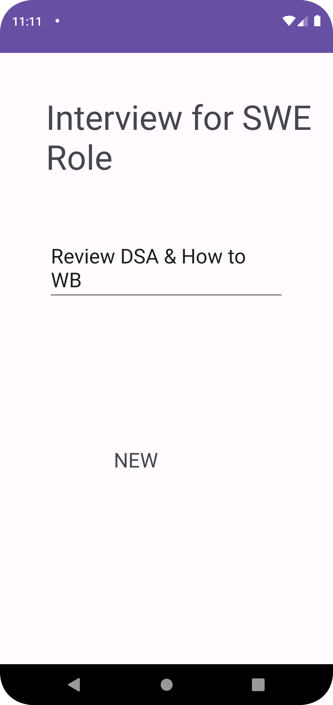
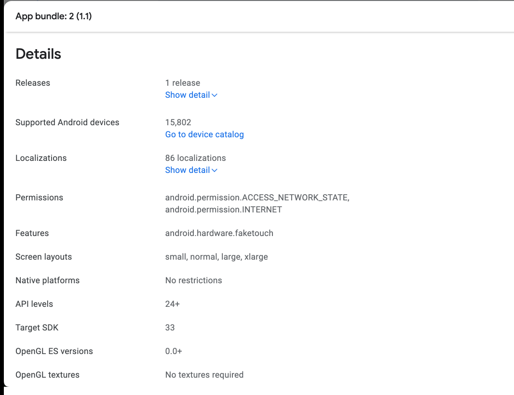

# taskMasterProject

An Android App Production

## Created By: Dasha Lewis

## App Images

### Change Log

Created a Task Details Page and utilized Intent and Shared Preferences to share data across Activities.

Added task lists in Scroll view on home page

Added Espresso Tests on buttons

Added Amplify for backend and saved user's tasks

Created ability to read from database

Submitted App for Review to Google

The process included finishing the first two items in Internal Review which gave some details about the app contents and the audience it is for

Also did Closed Testing and sent in track for review. This took significantly less time than the Internal Testing

Completed adding the recyclerView on the Main Activity but it does not show on the Main page. No errors 

